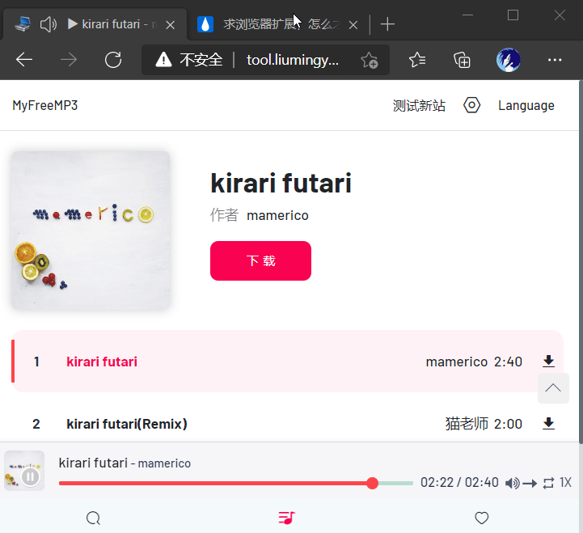
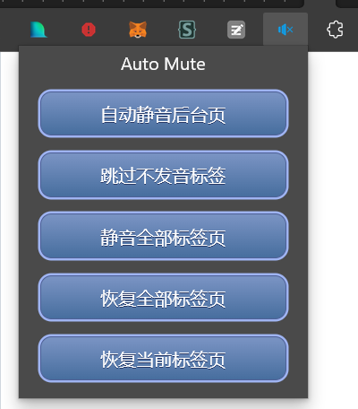

## Auto Mute  
这是一个Chrome/Chromium/Edge浏览器扩展，能够把后台标签页自动静音，当页面切换到前台时自动取消静音。

众所周知，Chrome系浏览器播放视频音频时，标签页有一个小喇叭图标，点击喇叭可以快速静音。
另一个方式是快捷键`Ctrl+M`。  
但是这两种方式都不够智能——有的时候需要只让前台页面发声，当我切换到其他页面时，自动静音。  
我在edge商店、Chrome商店都找到了一些扩展，但是我发现很奇怪的没有效果（也可能是我不会用？）  
所以自己搓了一个。  

已经上传Edge商店 https://microsoftedge.microsoft.com/addons/detail/ahnjeefliifcofmjceffghigncgoigmj

UI非常简单,一共3个按钮:
1. 是否自动静音后台页面
2. 一键静音当前打开的全部页面(只生效一次)
3. 一键恢复当前打开的全部页面(只生效一次)  

图标来自[iconfont](https://www.iconfont.cn/), 按钮样式来自[CSS Button Generator](https://www.bestcssbuttongenerator.com/#/1)
